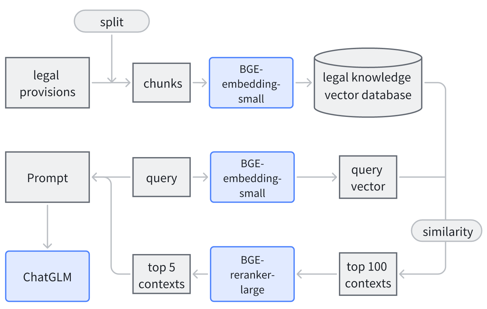

# LAW assistant based on ChatGLM3 and RAG 
基于 ChatGLM3与 RAG 的法律问答助手
## 任务描述
本任务使用 ChatGLM3 与 RAG 实现了一个中文法律问答助手
## 方法
RAG的整个过程如下所示。考虑到我们使用的数据集的规模很大，
我们将RAG的检索步骤分为两个阶段：召回和重新排序。

### Recall
最初，我们使用较小的embeddin模型得到向量库。具体来说，我们首先将法律文档分为若干 chunks，并使用BGE-small-embedding将这些chunks表示为向量。在查询阶段，我们首先通过相似检索将前100个与 query最相似的chunks作为候选文档。

### Reranking
在这个阶段，我们使用BGE-large-reranker对所有候选文档重新排序，并返回5个与 query最相似的文档。

## 评估
使用 GPT4评估添加 RAG 后 ChatGLM 的表现，使用的 Prompt 如下

    # 任务描述
    你是一个法律领域的专家，给你一个刑事诉讼相关的法律问题(Question)，以及两个法律助手(分别为Assistant1和Assistant2)对这个问题的回答，请你作为裁判，帮我判断哪个法律助手的答案更好。 
    如果你认为Assistant1的答案更好，请输出Assistant1; 如果你认 为Assistant2的答案更好，请输出 Assistant2，如果你认为两者差不多，请输出 Similar
    # 注意事项 
    你可以从以下角度进行判断:答案是否提供了关键信息，是否可信度高，权威性高?是否 准确，合理，具体? 
    请不要受到答案长短的干扰，更长的答案并不一定更好，更短的答案并不一定更差。 
    你需要简单解释你的理由。 
    你需要使用##分隔你的理由和答案，并严格按照输出格式输出你的答案。
    #输入格式:
    Question: 
    Assistant1: 
    Assistant2: 
    #输出格式: 
    理由##答案
### 结果

|                  | 1 win | 2 win | same |
|------------------|-------|-------|------|
| RAG+ChatGLM3 vs ChatGLM3 | 79    | 26    | 5    |
